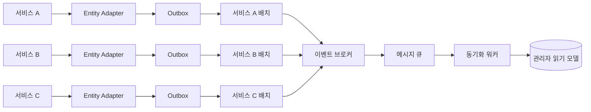

# 배치 수집에서 이벤트 기반 동기화로

저는 회사에서 여러 서비스의 데이터를 하나의 관리자 화면에 모아 보여주는 기능을 운영하고 있습니다. 서비스가 늘면서 관리자는 각 서비스의 상태를 한곳에서 확인할 수 있게 됐지만, 그만큼 데이터를 언제, 어떤 방식으로 맞출지에 대한 고민도 커졌습니다.

기존 시스템은 제가 합류하기 전부터 배치 수집 방식으로 운영되고 있었습니다. 하지만 기능과 데이터가 늘어날수록 단순히 "가져와서 저장하는" 일로 끝나지 않았고, 동기화 방식을 다시 설계할 필요가 생겼습니다. 이 글에서는 레거시 배치 구조의 한계와 CDC를 검토한 뒤, 도메인 이벤트 기반 동기화를 선택한 이유를 정리해보려 합니다.

## 문제 상황

### 배치 수집의 한계

기존에는 관리자 시스템의 배치 작업이 서비스 A, 서비스 B, 서비스 C의 데이터를 주기적으로 가져와 반영했습니다. 이 방식은 데이터가 생성된 순서와 다르게 수집될 수 있어 정합성을 맞추기 어려웠고, 서비스별 예외 처리와 재시도 로직이 관리자 배치에 쌓이면서 유지보수 복잡도도 커졌습니다. 조회 대상과 데이터량이 늘수록 생산자 서비스에 부하가 발생하고, 긴 배치 실행 중 타임아웃이 발생할 위험도 있었습니다.

### CDC를 선택하지 않은 이유

CDC(Change Data Capture)는 데이터베이스의 변경을 감지해 전달한다는 점에서 매력적인 선택지입니다. 변경된 데이터만 전달해야 하거나 대규모 변경을 스트리밍해야 하는 상황에서는 특히 적합할 수 있습니다.

다만 이 시스템에서 필요한 것은 "어떤 row가 변경되었는가"보다, "어떤 업무 상태가 확정됐고 관리자 화면에는 어떤 상태를 반영해야 하는가"였습니다. 데이터베이스의 일부 행 변경만으로 관리자 화면에 필요한 최종 상태를 항상 계산할 수 없었습니다. 기존 데이터베이스에 서비스 로직과 연관 관계가 많이 축적되어 있어, 하나의 변경을 해석하려면 관련 데이터를 다시 조회하고 로직을 재구성해야 하는 경우가 많았습니다.

결국 CDC를 도입해도 원본 데이터베이스 재조회가 빈번해지면 조회 부하와 타임아웃 위험이 남고, 동기화 계층에 서비스 로직을 다시 구현해야 하는 복잡성도 커집니다. 서비스의 업무 규칙이나 데이터 관계가 바뀔 때마다 CDC 이벤트를 해석하는 워커의 로직도 함께 수정하고 검증해야 한다는 점도 부담이었습니다. 생산자 서비스의 내부 변경이 동기화 워커의 변경으로 이어지면, 시간이 갈수록 두 시스템의 결합도는 다시 높아질 수 있습니다.

그래서 이 경우에는 업무적으로 의미가 확정된 시점에 필요한 정보를 함께 담아 발행하는 도메인 이벤트가 성능과 유지보수 측면에서 더 적합하다고 판단했습니다.

## 해결 방향

### 확정된 변경을 이벤트로 전달

각 서비스에서 업무 변경이 확정되면 엔터티별 Adapter를 통해 관리자 동기화에 필요한 이벤트를 Outbox 테이블에 기록하도록 변경했습니다. 이후 각 서비스의 배치가 Outbox에 저장된 미발행 이벤트를 조회해 메시지 브로커로 전달하고, 동기화 워커가 이를 소비해 관리자용 읽기 모델에 반영하도록 구성했습니다.

기존에는 관리자가 필요한 데이터를 얻기 위해 각 서비스를 주기적으로 조회해야 했습니다. 변경 후에는 업무 변경 시점에 필요한 데이터를 Outbox에 기록하고 변경된 데이터만 전달할 수 있게 됐습니다. 따라서 전체 데이터를 반복적으로 조회하는 비용을 줄이면서도 기존 배치 실행 구조를 활용해 점진적으로 이벤트 기반 동기화로 전환할 수 있었습니다.



이 구조에서 워커는 HTTP API를 제공하지 않습니다. 이벤트를 받아 검증하고, 관리자 화면에 필요한 형태로 변환해 저장하는 데만 집중합니다. 생산자 데이터베이스를 직접 변경하지 않으므로 서비스 간 결합도도 낮습니다.

### 발행 실패 관리

이후 각 서비스의 배치 작업이 아직 발행되지 않은 Outbox 데이터를 읽어 이벤트 브로커로 전달합니다. 발행에 실패한 데이터는 재시도 횟수와 함께 상태를 기록하고, 한도를 넘기면 실패 상태로 남겨 운영에서 확인할 수 있도록 했습니다.

## 구조 설계

이벤트 기반으로 바꾼다고 해서 정합성이 자동으로 보장되지는 않습니다. 중복 처리, 순서 역전, 부분 업데이트를 고려한 처리 구조가 필요했습니다.

### 이벤트 처리 흐름

1. 동기화 워커가 큐에서 메시지를 받습니다.
2. 메시지의 기본 정보와 이벤트 데이터를 확인합니다.
3. 이미 처리한 이벤트인지 확인합니다.
4. 이벤트 종류에 맞는 처리 로직을 실행합니다.
5. 하나의 작업 단위 안에서 이벤트 데이터를 관리자 화면에 필요한 형태로 저장합니다.
6. 모든 처리가 성공한 경우에만 처리 완료를 기록하고 메시지를 삭제합니다.

실패한 메시지는 워커가 임의로 삭제하지 않습니다. 메시지 브로커의 재전달과 dead-letter queue 정책에 맡겨 재시도와 격리를 일관되게 처리합니다.

### 순서가 뒤바뀌어도 안전하게 만들기

표준 큐에서는 이벤트가 순서대로 도착한다는 보장이 없습니다. 같은 엔터티의 변경 이벤트가 재전달되거나 역순으로 도착해도 오래된 데이터가 최신 데이터를 덮어쓰지 않도록 upsert 조건에 변경 시각을 사용했습니다.

```sql
-- 개념 예시
ON CONFLICT (entity_id)
DO UPDATE SET ...
WHERE target.updated_at <= EXCLUDED.updated_at;
```

배열 형태의 이벤트 데이터도 먼저 정리합니다. 동일한 식별자를 가진 항목이 여러 개라면 변경 시각이 가장 최신인 항목만 남긴 뒤 저장합니다. 데이터베이스의 조건부 upsert까지 함께 적용하면, 하나의 메시지 내부 중복과 메시지 간 역순 도착을 모두 방어할 수 있습니다.

### 이벤트별 처리 원칙

이벤트의 업무 이름보다 데이터가 어떻게 바뀌는지를 기준으로 처리 원칙을 나눴습니다.

| 이벤트 유형 | 처리 원칙 | 주의점 |
| --- | --- | --- |
| 단일 상태 변경 | 변경 시각을 기준으로 최신 상태만 반영 | 오래된 이벤트가 최신 상태를 덮어쓰지 않도록 방어 |
| 여러 데이터가 함께 바뀌는 변경 | 하나의 작업 단위로 함께 반영 | 일부 실패 시 전체 변경을 취소 |
| 부분 업데이트 | 전달된 필드만 갱신하고 같은 대상의 순서를 보장 | 이전 변경이 나중에 반영되지 않도록 방어 |
| 이력성 데이터 | 같은 이벤트를 한 번만 추가 | 중복 처리와 민감 정보 노출 방지 |
| 삭제 이벤트 | 명시적으로 삭제 처리 | 재처리 전 현재 데이터와 영향 범위 확인 |

### 큐를 나눈 기준

대부분의 상태 동기화 이벤트는 표준 큐로 처리할 수 있습니다. 반면 부분 업데이트가 연속으로 발생하고 동일 엔터티의 순서가 중요한 이벤트는 FIFO 큐 또는 동등한 순서 보장 전략을 선택합니다. 핵심은 큐 종류 자체보다 **멱등성**, **최신성 비교**, 그리고 필요한 범위의 **순서 보장**을 함께 설계하는 것입니다.

특히 성능을 위해 캐시를 사용하고 변경된 필드만 전달하는 partial update 방식의 서비스는 FIFO 큐를 사용했습니다. partial update는 전체 상태를 매번 다시 조회하거나 전송하지 않아 처리량과 저장소 부하를 낮출 수 있습니다. 하지만 같은 엔터티의 변경 순서가 바뀌면 이전 값이 최신 값을 덮어쓸 수 있습니다.

그래서 엔터티 식별자를 메시지 그룹 키로 사용해 같은 그룹 안에서는 발행 순서대로 처리되도록 보장했습니다. 서로 다른 엔터티는 병렬 처리할 수 있으므로, 순서 보장과 처리 성능을 함께 확보할 수 있습니다.

## 결과

이 구조로 전환하면서 관리자 시스템이 각 서비스에 반복적으로 조회를 요청하던 부하를 줄이고, 변경 시점에 가까운 데이터를 반영할 수 있게 됐습니다. 또한 순서가 바뀌거나 같은 이벤트가 다시 전달되는 상황을 동기화 계층에서 일관되게 처리해 데이터 정합성을 높였습니다.

무엇보다 서비스별 조회·예외 처리 로직을 하나의 배치에 계속 추가하는 대신, 각 서비스는 자신의 업무 변경을 이벤트로 알리고 동기화 워커는 이를 반영하는 역할에 집중하게 됐습니다. 그 결과 기능이 늘어나도 책임 경계를 비교적 명확하게 유지할 수 있었습니다.
