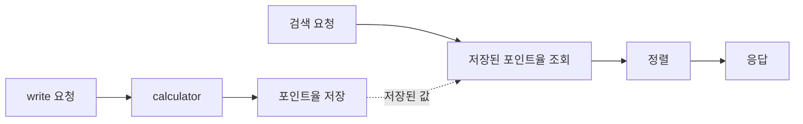

데이터베이스에서 read와 write는 동등하지 않습니다. 적어도 읽기 요청이 대부분인 일반적인 웹 서비스에서는 그렇습니다.

사용자는 데이터를 한 번 쓰고 여러 번 조회합니다. 목록을 보고, 검색하고, 정렬하고, 필터링하고, 다시 같은 화면으로 돌아옵니다.

그렇다면 성능을 개선할 때도 두 작업을 같은 무게로 보면 안 됩니다. 자주 발생하는 read는 최대한 단순해야 하고, 상대적으로 덜 발생하는 write는 조금 더 복잡해져도 됩니다.

이번 글에서는 실제로 검색 성능을 개선했던 경험을 바탕으로, read 시점의 계산을 write 시점으로 옮겼을 때 어떤 변화가 있었는지 정리해보려 합니다.

## 문제 상황

기존 검색 기능은 PostgreSQL view를 사용하고 있었습니다.

view는 복잡한 조회 로직을 감추기에는 편했습니다. 여러 테이블을 조합하고, 조건을 적용하고, 필요한 값을 계산해 하나의 조회 대상으로 다룰 수 있었기 때문입니다.

물론 view 자체가 문제였던 것은 아닙니다. 문제는 view를 조회할 때마다 포인트율을 계산하고, 그 값을 기준으로 검색 결과를 정렬해야 했다는 점이었습니다.

검색 결과는 특정 포인트율을 기준으로 정렬되어야 했습니다. 그런데 이 포인트율은 이미 저장된 컬럼이 아니라, 여러 조건을 바탕으로 매번 계산되는 값이었습니다.

즉, 검색 요청이 들어올 때마다 데이터베이스는 다음 작업을 반복하고 있었습니다.

- 조건에 맞는 데이터를 찾습니다.
- view를 통해 필요한 데이터를 구성합니다.
- 포인트율을 새로 계산합니다.
- 계산된 포인트율을 기준으로 정렬합니다.
- 최종 결과를 반환합니다.

데이터가 적을 때는 큰 문제가 아니었습니다. 하지만 데이터가 늘어나고 검색 요청이 많아지면서 이 구조는 점점 부담이 되었습니다.

핵심 문제는 간단했습니다.

매번 새로 계산하지 않아도 되는 값을 read 시점마다 반복해서 계산하고 있었습니다.

## 빠른 대응으로 캐시를 적용

당장 검색 응답이 느렸기 때문에 먼저 빠르게 문제를 완화할 방법이 필요했습니다.

그래서 쿼리 결과를 메모리에 캐시하고, 동일한 검색 조건에 대해서는 캐시된 결과를 응답에 활용했습니다.

이 방식은 즉각적인 효과가 있었습니다. 반복되는 검색 요청에 대해서는 데이터베이스에 같은 부담을 주지 않아도 되었고, 사용자 입장에서도 응답이 빨라졌습니다.

하지만 캐시는 근본적인 해결책은 아니었습니다.

캐시는 느린 쿼리를 빠르게 만든다기보다, 느린 쿼리를 덜 실행하게 만드는 방식에 가깝습니다. 캐시가 비어 있거나 만료되면 결국 같은 비싼 쿼리를 다시 실행해야 합니다. 데이터 변경 시점과 캐시 무효화 전략도 계속 신경 써야 합니다.

결국 병목은 그대로 남아 있었습니다.

검색 요청마다 포인트율을 계산하고, 그 결과를 기준으로 정렬하는 구조 자체가 문제였습니다.

## 계산 시점의 변경

포인트율은 조회할 때마다 새로 계산될 필요가 없었습니다. 데이터가 변경되는 시점에만 다시 계산하면 충분했습니다. 그렇다면 계산을 read 시점에 둘 이유가 없었습니다.

여기서 선택지는 두 가지였습니다.

- 정규화된 구조를 유지하고 read 시점마다 계산한다.
- 계산된 값을 컬럼에 저장하고 write 시점에 갱신한다.

정규화 관점에서는 첫 번째가 더 깔끔해 보일 수 있습니다. 원본 데이터만 저장하고, 계산 가능한 값은 필요할 때 계산하는 방식이기 때문입니다.

하지만 성능 관점에서는 두 번째가 더 적합했습니다.

포인트율 계산식은 단순하지 않았습니다. 실제 계산식은 공개하기 어렵지만, 안전마진과 로그 스케일링 같은 보정이 포함되어 있었습니다. 이 계산을 검색 요청마다 반복하는 것은 불필요한 비용이었습니다.

그래서 계산된 포인트율을 저장하는 컬럼을 추가했습니다.

## Write에 복잡성을 두기

구조를 바꾼 뒤에는 데이터를 쓰는 쪽에서 포인트율을 계산하도록 했습니다.

데이터가 생성되거나 수정될 때 필요한 계산식을 적용하고, 그 결과를 포인트율 컬럼에 저장합니다. 원본 데이터가 바뀌면 포인트율도 함께 다시 계산됩니다.

### 변경 전: read 시점에 계산

### 변경 후: write 시점에 계산

이 방식은 분명히 중복 저장입니다.

원본 값들로부터 다시 계산할 수 있는 값을 별도 컬럼으로 저장하기 때문입니다. 정규화 관점에서 보면 어색할 수 있습니다. 원본 데이터와 계산된 데이터 사이의 일관성을 관리해야 하는 책임도 생깁니다.

하지만 실무에서는 이런 중복이 필요한 순간이 있습니다.

중요한 것은 중복을 절대 만들지 않는 것이 아니라, 중복된 값을 어디서 어떻게 일관성 있게 관리할 것인지입니다.

read가 write보다 훨씬 많다면, write 시점에 조금 더 많은 일을 하는 것이 전체 시스템에는 더 유리할 수 있습니다.

## 트레이드오프

이 선택은 단순히 컬럼을 하나 추가하는 작업이 아니었습니다.

read 시점의 계산 비용을 줄이는 대신, write 경로의 복잡도를 감수해야 했습니다. 사용자가 웹에서 직접 데이터를 입력하는 경우, 배치 작업으로 데이터가 업데이트되는 경우, 관리자가 데이터를 수정하는 경우 모두 같은 포인트율 계산식을 사용해야 했습니다.

만약 각 경로에서 계산식을 따로 구현했다면 더 큰 문제가 되었을 것입니다.

처음에는 같은 결과를 내더라도 시간이 지나면서 특정 API에는 새로운 보정식이 반영되고, 배치에는 누락되고, 관리자 수정 경로에는 예전 계산식이 남아 있을 수 있습니다. 그러면 저장된 포인트율 컬럼은 더 이상 신뢰할 수 없는 값이 됩니다.

즉, 트레이드오프는 다음과 같았습니다.

- read 시점의 반복 계산을 제거한다.
- 대신 모든 write 경로에서 계산식을 반드시 실행해야 한다.
- 계산 결과를 저장하므로 데이터 정합성 관리 책임이 생긴다.
- 계산식이 여러 곳에 흩어지지 않도록 코드 구조를 바꿔야 한다.

이를 해결하기 위해 포인트율 계산 로직을 별도의 calculator 클래스로 분리했습니다.

웹 입력, 배치 업데이트, 관리자 수정 로직은 각자 계산식을 직접 구현하지 않고 같은 calculator를 호출하도록 변경했습니다. 각 서비스는 계산 방식을 알 필요 없이, 데이터를 저장하기 전에 calculator를 호출하면 됩니다.

이후 전체 서비스가 모노레포로 재구성되면서 이 구조는 더 명확해졌습니다. 공통 패키지에 calculator를 두고, 여러 서비스가 같은 계산 로직을 공유하도록 만들었습니다.

결과적으로 write 경로는 이전보다 복잡해졌지만, 복잡도가 한 곳으로 모였습니다. 계산식은 calculator 한 곳에서 관리했고, 웹 요청과 배치 작업이 동일한 계산 로직을 사용했습니다.

다만 모든 write 경로에서 calculator를 호출하도록 했다고 해서 정합성이 항상 보장되는 것은 아닙니다. 계산 로직이 누락된 경로가 생기거나, 일부 작업이 실패해 원본 데이터와 계산된 값이 달라질 가능성도 있었습니다.

이를 보완하기 위해 매일 새벽 원본 데이터를 기준으로 포인트율을 다시 계산하고, 저장된 값과 다른 데이터만 보정하는 배치 작업을 실행했습니다. 이 배치 역시 별도의 계산식을 구현하지 않고 같은 calculator를 사용했습니다.

실시간 write 경로에서 계산값을 갱신하고, 정기 배치에서 전체 데이터의 정합성을 다시 보정하는 구조였습니다. 덕분에 조회 시점에는 저장된 값을 신뢰하면서도, 누락이나 일시적인 불일치가 장기간 유지되는 것을 방지할 수 있었습니다.

## Read는 단순하게

이후 조회 쿼리는 훨씬 단순해졌습니다.

이제 검색 요청이 들어와도 데이터베이스는 포인트율을 매번 계산하지 않습니다. 이미 저장된 포인트율 컬럼을 읽고, 그 값을 기준으로 정렬하면 됩니다.

복잡한 계산은 write 시점으로 이동했고, read 시점에는 단순한 조회와 정렬만 남았습니다.

동일한 데이터와 검색 조건을 기준으로 측정했을 때, 수 초까지 걸리던 검색 API 응답 시간은 약 200ms 수준까지 줄어들었습니다.

## 같은 패턴은 다른 곳에서도 반복된다

이 패턴은 이 사례에만 있는 것이 아닙니다.

성능을 위해 read를 단순하게 만들고 write를 복잡하게 만드는 선택은 여러 곳에서 반복됩니다.

| 패턴              | Read에서 얻는 이점                       | 추가로 관리할 책임                         |
| ----------------- | ---------------------------------------- | ------------------------------------------ |
| Cache-aside       | 캐시 hit 시 원본 저장소 접근을 줄입니다. | 무효화, 만료, 갱신 전략                    |
| Read replica      | 여러 replica로 조회 트래픽을 분산합니다. | 복제 지연, read-after-write 일관성, 라우팅 |
| Denormalization   | join 없이 단순하게 조회합니다.           | 중복 데이터의 정합성                       |
| CQRS              | 읽기 모델을 조회에 맞게 구성합니다.      | 모델 동기화와 반영 지연                    |
| Materialized view | 미리 계산된 조회 결과를 읽습니다.        | refresh 시점과 데이터 최신성               |

형태는 다르지만 방향은 비슷합니다. 자주 발생하는 read를 단순하게 만들기 위해, write 경로나 동기화 과정에 더 많은 책임을 둡니다.

## 결국 중요한 건 책임의 위치

이번 개선의 핵심은 단순히 계산 결과를 컬럼에 저장했다는 데 있지 않습니다.

핵심은 반복되는 비용을 어디에 둘 것인가였습니다.

read 시점에 매번 계산할 것인가.  
write 시점에 한 번 계산해서 저장할 것인가.

읽기 요청이 대부분인 서비스라면 read는 최대한 단순해야 합니다. 반대로 write는 조금 더 복잡해져도 됩니다. 사용자가 훨씬 자주 경험하는 것은 쓰기보다 읽기이기 때문입니다.

물론 모든 계산 값을 컬럼으로 저장해야 한다는 뜻은 아닙니다. 중복 저장에는 분명히 비용이 있습니다. 데이터 정합성을 관리해야 하고, 계산식이 바뀔 때 기존 데이터도 다시 계산해야 할 수 있습니다.

하지만 read 성능이 중요한 경로라면, 정규화만을 기준으로 판단해서는 안 됩니다.

성능 개선은 종종 책임의 위치를 바꾸는 일입니다.

자주 발생하는 read를 단순하게 만들기 위해, 덜 자주 발생하는 write가 더 많은 책임을 가져야 할 때가 있습니다.
